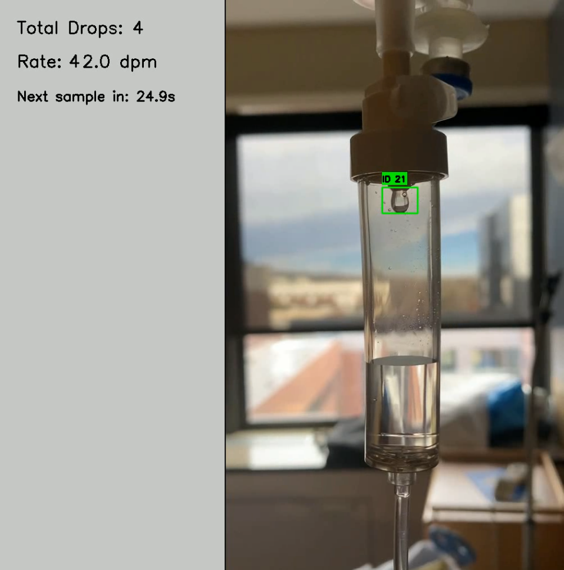
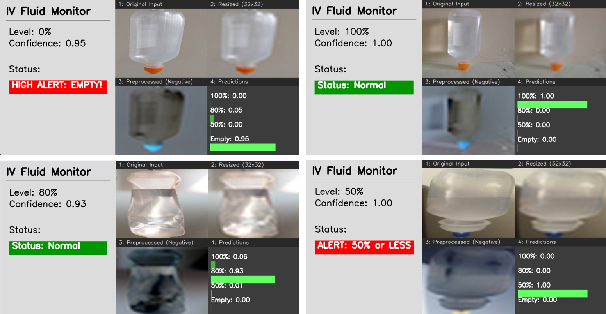
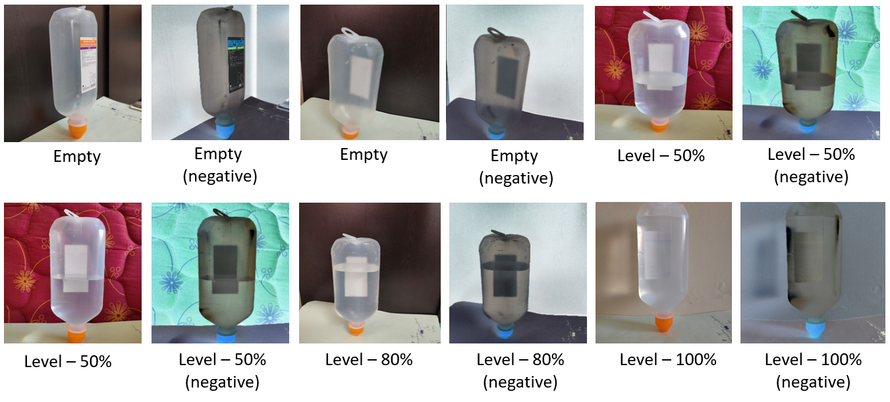

# IV Fluid Monitoring System

A comprehensive computer vision system for monitoring intravenous (IV) fluid administration, featuring both **drop counting** and **fluid level detection** capabilities.

## 🎯 Project Overview

This system provides real-time monitoring of IV fluid administration through two main components:

1. **Drop Counting System** - Tracks individual drops and calculates drip rates
2. **Fluid Level Detection** - Monitors remaining fluid levels and provides alerts

## 🚀 Features

### Drop Counting System
- **Real-time drop detection** using YOLO-based object tracking
- **Drip rate calculation** (drops per minute) with configurable time windows
- **Visual tracking interface** with bounding boxes and track IDs
- **CSV logging** of drip rate statistics
- **Side-by-side dashboard** showing live video and statistics

### Fluid Level Detection
- **CNN-based classification** of fluid levels (0%, 50%, 80%, 100%)
- **Real-time monitoring** with visual dashboard
- **Alert system** for low fluid levels (≤50%)
- **Image preprocessing pipeline** with negative filtering
- **2x2 visualization grid** showing processing steps

## 📁 Project Structure

```
final/
├── drop_count_main.py              # Main drop counting application
├── level_alert_main.py             # Main fluid level detection application
├── iv-fluids-final-working.ipynb   # Training notebook for level detection model
├── drop_counting_model.pt          # YOLO model for drop detection
├── iv-fluids-level-detection.h5    # CNN model for level detection
├── drop_count_processed_vid.mp4    # Sample processed drop counting video
├── testing_vid_drop_count.mp4      # Test video for drop counting
├── real_time_drop_output.png       # Screenshot of drop counting interface
├── level_monitor_output.png        # Screenshot of level detection dashboard
├── negative_filter_examples.png    # Examples of image preprocessing
└── README.md                       # This file
```

## 🖼️ Visual Examples

### Drop Counting Interface

*Real-time drop counting with tracking visualization and statistics panel*

### Level Detection Dashboard

*Comprehensive dashboard showing fluid level detection with 2x2 processing grid*

### Image Preprocessing

*Examples of the negative filtering preprocessing step used for level detection*

## 🎥 Video Demonstrations

### Drop Counting Demo
- **File**: `drop_count_processed_vid.mp4`
- **Description**: Shows the drop counting system in action with real-time tracking and rate calculation

### Test Video
- **File**: `testing_vid_drop_count.mp4`
- **Description**: Sample video for testing the drop counting functionality

## 🛠️ Installation & Setup

### Prerequisites
```bash
pip install opencv-python
pip install ultralytics
pip install tensorflow
pip install pillow
pip install numpy
pip install pandas
pip install matplotlib
pip install seaborn
pip install scikit-learn
```


## 🚀 Usage

### Drop Counting System

```python
python drop_count_main.py
```

**Configuration Options:**
- `WINDOW_DURATION`: Time window for drip rate calculation (default: 15 seconds)
- `RECHECK_INTERVAL`: Interval between rate samples (default: 30 seconds)
- `min_track_duration`: Minimum frames for valid drop detection (default: 3)
- `min_y_travel`: Minimum downward travel for valid drop (default: 10 pixels)

**Output:**
- Real-time video with tracking visualization
- CSV file with drip rate statistics
- Processed video with side-by-side interface

### Fluid Level Detection

```python
python level_alert_main.py
```

**Configuration Options:**
- `ALERT_THRESHOLD_PCT`: Alert threshold percentage (default: 50%)
- `MODEL_IMG_SIZE`: Input image size for model (default: 32x32)

**Features:**
- Real-time level monitoring
- Visual dashboard with processing pipeline
- Alert system for low levels

## 🧠 Model Architecture

### Drop Detection Model
- **Type**: YOLO (You Only Look Once) object detection
- **Purpose**: Real-time drop detection and tracking
- **Input**: Video frames
- **Output**: Bounding boxes and track IDs for drops

### Level Detection Model
- **Type**: Convolutional Neural Network (CNN)
- **Architecture**: Sequential model with Conv2D, MaxPooling2D, Dense layers
- **Input**: 32x32 pixel images (negative filtered)
- **Output**: 4-class classification (0%, 50%, 80%, 100%)
- **Preprocessing**: Negative filtering to emphasize fluid transparency

## 📊 Performance Metrics

### Level Detection Model
- **Accuracy**: High accuracy on saline bottle level classification
- **Classes**: 4 distinct fluid levels
- **Real-time**: Sub-second inference time
- **Robustness**: Handles various lighting conditions

### Drop Counting System
- **Tracking**: Persistent object tracking across frames
- **Validation**: Minimum duration and travel distance filters
- **Rate Calculation**: Configurable time windows for statistics
- **Visualization**: Real-time bounding box and ID display

## 🔧 Configuration

### Drop Counting Parameters
```python
WINDOW_DURATION = 15    # seconds for drip rate calculation
RECHECK_INTERVAL = 30   # seconds between rate samples
min_track_duration = 3  # minimum frames for valid drop
min_y_travel = 10       # minimum downward travel (pixels)
```

### Level Detection Parameters
```python
ALERT_THRESHOLD_PCT = 50  # alert when ≤ 50%
MODEL_IMG_SIZE = 32       # input image size
CLASS_LABELS = ['sal_data_100', 'sal_data_80', 'sal_data_50', 'sal_data_empty']
```


## 🎓 Training

The level detection model was trained using the notebook `iv-fluids-final-working.ipynb` with:
- **Dataset**: IV fluids level dataset from Mendeley Data
- **Preprocessing**: Negative filtering and 32x32 resizing
- **Architecture**: CNN with dropout for regularization
- **Training**: Early stopping and model checkpointing

## 📈 Future Enhancements

- [ ] Integration of both systems into a unified interface
- [ ] Web-based dashboard for remote monitoring
- [ ] Database logging for historical analysis
- [ ] Mobile app for alerts and monitoring
- [ ] Additional fluid types support
- [ ] Edge deployment optimization

## 🤝 Contributing

1. Fork the repository
2. Create a feature branch
3. Make your changes
4. Add tests if applicable
5. Submit a pull request

## 📄 License

This is an educational and research project. No formal license is provided. This project is intended for academic and research purposes only.

## 📝 Authors

1. [Nishant V H](https://github.com/NishantHegde2305)
2. Saksham Gupta

## 🙏 Acknowledgments

- Dataset sources: Mendeley Data (DOI: 10.17632/9mcj3rvvxb.1, 10.17632/n8k2zfr6xm.2)
- YOLO implementation: Ultralytics
- Computer vision: OpenCV
- Deep learning: TensorFlow/Keras

---


**Note**: This system is designed for research and educational purposes. For clinical use, additional validation and regulatory compliance may be required. 
